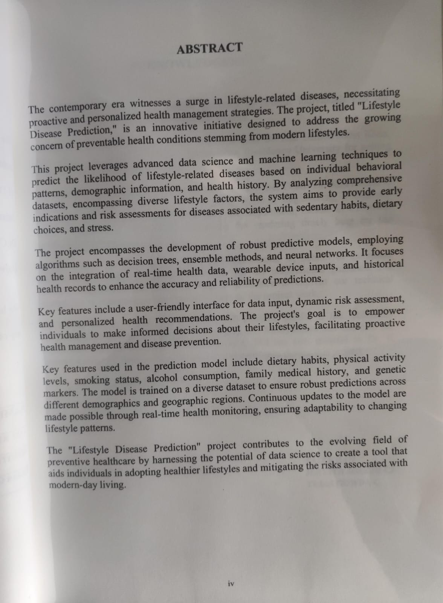
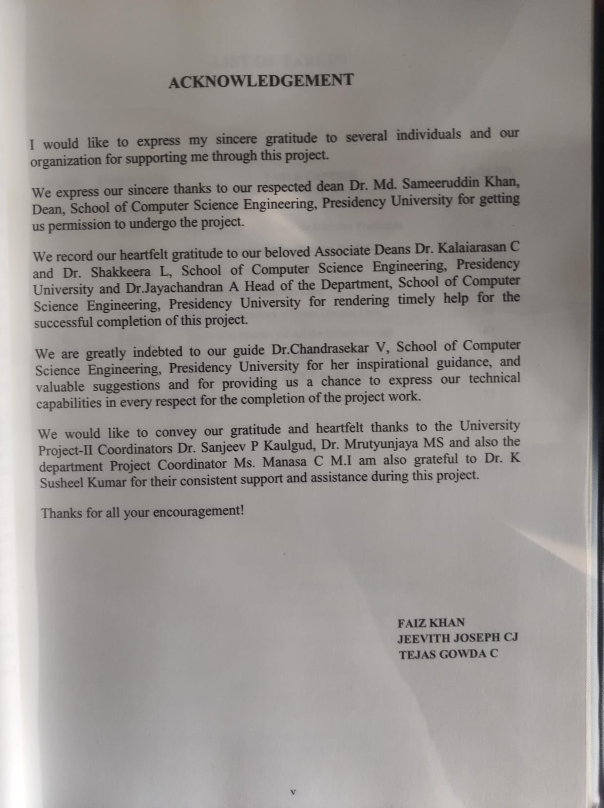

# Lifestyle Disease Prediction

## Project Overview

The "Lifestyle Disease Prediction" project is a web-based application that uses predictive modeling to assess an individual's risk of developing lifestyle-related diseases. The project aims to empower individuals to make informed decisions about their health by providing accurate predictions and promoting health awareness.

## Project Features

- Accurate prediction of lifestyle diseases based on user-provided data.
- User-friendly web interface for easy data input and result visualization.
- Integration of machine learning models for disease prediction.
- Educational resources to enhance user health awareness.
- Data privacy and security measures for user data protection.

## Project Topic

**Background:** Lifestyle-related diseases, such as diabetes, heart disease, and obesity, have become increasingly prevalent in today's society. Early detection and intervention are crucial to reducing the impact of these diseases on individuals and healthcare systems.

**Objective:** The project's primary objective is to develop a web-based platform that predicts the likelihood of lifestyle diseases using demographic and vital statistics. By providing accurate predictions and promoting health awareness, the project aims to improve public health and reduce healthcare costs.

## Usage

1. Access the web application through your browser.
2. Input your demographic and vital statistics for disease prediction.
3. Receive an accurate prediction of your risk of developing specific lifestyle diseases.
